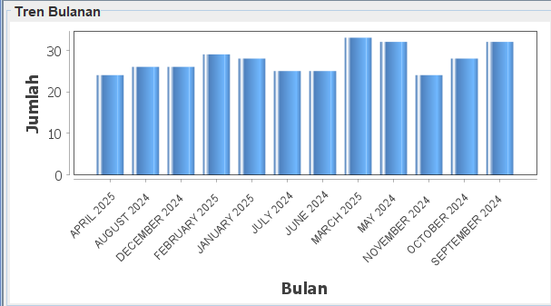
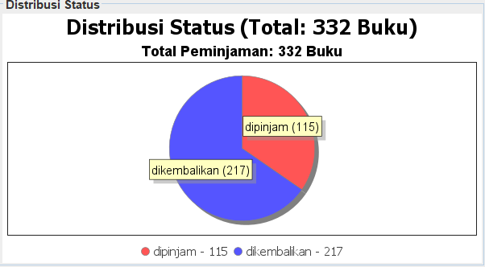
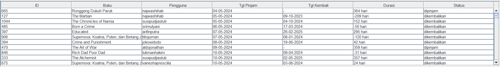

# Sistem Manajemen Peminjaman Buku Perpustakaan

Sebuah aplikasi desktop untuk mengelola peminjaman buku di perpustakaan menggunakan Java Swing dan MySQL.

## 📚 Fitur yang Tersedia

### 1. Sistem Autentikasi [ Laude ]
- **Login** dengan dua role:
  - **Admin**: Akses penuh ke semua fitur
  - **User**: Hanya bisa meminjam dan melihat riwayat
- **Session Management**: Penyimpanan data user yang login

### 2. Manajemen Buku (Admin Only)
- ✅ Tambah buku baru
- ✏️ Edit informasi buku
- ❌ Hapus buku
- 🔍 Cari buku berdasarkan judul/pengarang (belum ada)
- 📋 Tampilkan daftar buku lengkap [ ammar ] 
- ⚠️ Validasi input (stok tidak boleh negatif)

### 3. Manajemen User (Admin Only)  [ Iqbal] 
- 👥 Tambah user baru (admin/user) (belum ada)
- 📝 Edit data user 
- 🗑️ Hapus user 

### 4. Peminjaman Buku
- 📥 Proses peminjaman (otomatis kurangi stok)
- 📤 Pengembalian buku (update status & stok)
- 📋 Riwayat peminjaman per user
- ⏳ Tampilkan buku yang sedang dipinjam
  
### 5. Laporan Lanjutan 
- **Filter Tanggal**  
  Date picker untuk rentang tanggal mulai dan akhir
- **Filter Status**  
  Dropdown pilihan: Semua Status/Dipinjam/Dikembalikan
- **Filter Buku**  
  Dropdown otomatis terisi judul buku dari database
- **Filter Pengguna**  
  Dropdown otomatis terisi username pengguna
- **Tombol Aksi**  
  - Terapkan Filter
  - Reset Filter
  - Ekspor PDF (Coming Soon)
### 6. **Visualisasi Data Interaktif**
#### a. Tren Bulanan (Bar Chart)

- Menampilkan fluktuasi peminjaman per bulan
- Fitur interaktif:
  - Zoom & pan dengan mouse
  - Tooltip detail per bulan
  - Auto-scaling axis

#### b. Distribusi Status (Pie Chart)

- Perbandingan persentase status peminjaman
- Informasi tambahan:
  - Total buku dipinjam
  - Detail per kategori:
    - Jumlah buku
    - Persentase
  - Warna berbeda tiap kategori

### 7. **Tabel Data Peminjaman**

- Kolom informasi:
  - ID Transaksi
  - Judul Buku
  - Username Peminjam
  - Tanggal Pinjam/Kembali
  - Durasi Peminjaman
  - Status
- Fitur:
  - Sorting kolom
  - Auto-resize kolom
  - Scroll horizontal/vertikal
  - Responsive layout
    
### 8. Antarmuka Pengguna
- 🖥️ Dashboard admin dengan tabel interaktif
- 📱 Responsive layout dasar
- 💬 Dialog konfirmasi dan error
- 🎨 Tema dasar (belum ada dark mode)
- Background Processing - Load data tanpa freeze UI

## 🚧 Rencana Pengembangan (Fitur yang Akan Datang)

### 1. Sistem Denda Otomatis
- ⏰ Perhitungan denda keterlambatan
- 💰 Manajemen pembayaran denda
- 📆 Kalender jatuh tempo

### 2. Sistem Reservasi Buku
- 🗓️ Antrian reservasi buku
- 🔔 Notifikasi ketersediaan buku
- ⚠️ Batas waktu pengambilan reservasi

### 3. Laporan Lanjutan
- 📈 Statistik peminjaman (grafik bulanan/tahunan)
- 📉 Analisis buku populer
- 📊 Laporan PDF/Excel

### 4. Keamanan Enhanced
- 🔒 Reset password via email
- 🔑 Validasi kekuatan password
- 📜 Audit log aktivitas sistem

### 5. Fitur Tambahan
- 🔄 Batch import/export data
- 🌓 Dark mode toggle
- 📱 Responsive layout improvement
- 🔍 Pencarian multi-kriteria

  
## 🛠️ Teknologi Digunakan
- **Frontend**: Java Swing
- **Backend**: MySQL
- **Arsitektur**: MVC Pattern
- **SwingWorker** - Background threading
- **Libraries**: 
  - MySQL Connector/J
  - JDBC untuk koneksi database
  - JFreeChart 1.5.3


## 🚀 Panduan Instalasi

### Prasyarat
- Java JDK 8+
- MySQL Server 5.7+
- IDE (Eclipse/IntelliJ)

1. Clone repositori:
   ```bash
   git clone https://github.com/lildwagz/LBS.git
   ```
2. Import ke IDE (IntelliJ/Eclipse)
3. Setup database:

```bash
CREATE DATABASE perpustakaan;
USE perpustakaan;
-- Jalankan script SQL dari file perpustakaan.sql
```

4. Configurasi Database
   Buka file src/util/DBConnection.java, dan ubahlah parameter dengan kebutuhan

   ```bash
   private static final String URL = "jdbc:mysql://localhost:3306/perpustakaan";
    private static final String USER = "root";
    private static final String PASS = "root";
   ```

## 📄 Lisensi
MIT License - Lihat [LICENSE](LICENSE) untuk detail
